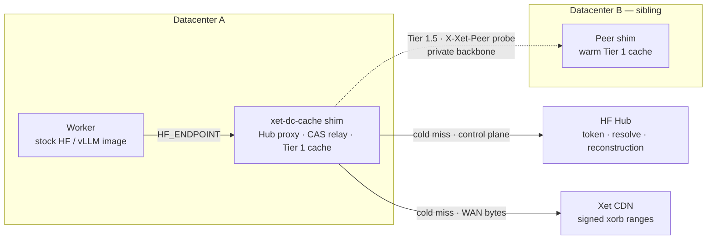
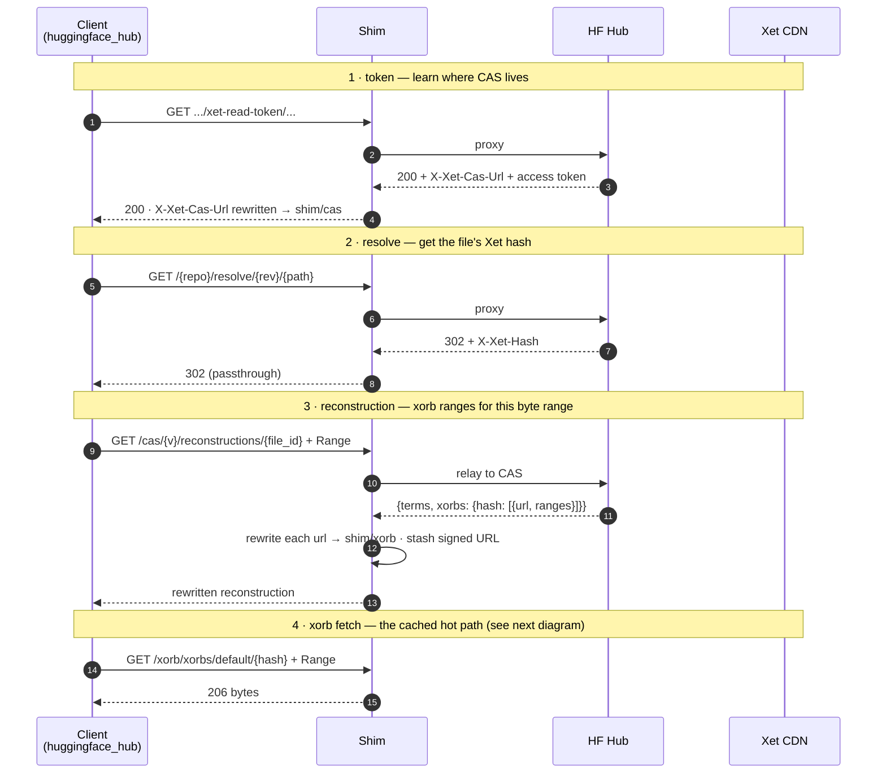
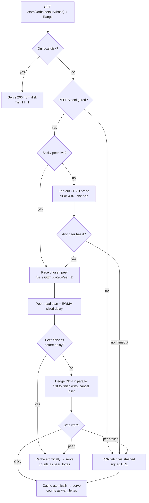
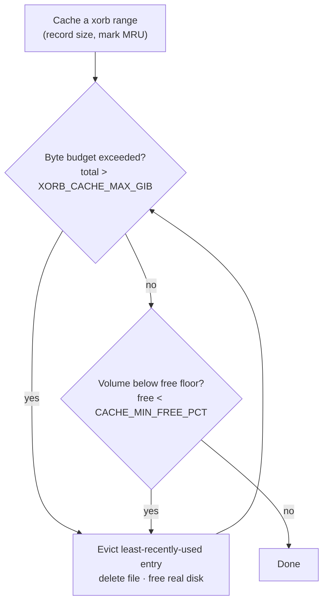

# Xet-Aware DC Cache

A datacenter-local caching layer that lets **stock HF/vLLM images pull Xet-backed
models at LAN speed** — no Dockerfile changes required. It buffers the WAN and kills
the repeated model-download tax that serverless scale-out pays on every cold start.

The fix lives **below the user's container** (env injection via `HF_ENDPOINT`), so
users who bring a pre-built vLLM image get it for free.

---

## How it works

### Topology — where the shim sits

Each worker points `HF_ENDPOINT` at a datacenter-local shim, so all HuggingFace
traffic flows through it. The shim serves cached xorb ranges from local disk;
on a miss it can pull from a **sibling shim** over a private backbone (Tier 1.5)
before paying the WAN cost of the CDN.

> **Where should the shim run — one per host, or a shared pool per DC?** See
> `docs/cache-topology.md` for the host-level vs DC-level trade-offs and the
> recommended per-host-placement + peering default.



### The download protocol (client → shim → CDN)

A Xet download is a four-step dance. The shim proxies the first three (rewriting
URLs so the client keeps talking to the shim) and caches the fourth — the actual
bytes.



### The xorb miss path (Tier 1 → Tier 1.5 → CDN)

Step 4 above is where caching happens. Peering is a strict accelerator: every
peer failure mode falls through to the CDN, so a request can never *fail* that the
CDN would have served. Latency bound: within a **single** peer race a lagging
peer is raced against the CDN, so that race finishes within `PEER_HEDGE_MAX_MS`
of a direct WAN pull (plus one discovery HEAD RTT on a cold, non-sticky range).
This bound is **per race**, not per request: when the CDN *itself* fails, the
miss path retries — a failed sticky race clears the sticky peer and a fan-out
race is tried, and if that also fails (peer *and* CDN) the plain CDN path runs
as a last resort. That resilience chain is gated entirely on CDN failure, but
when it triggers the request can take longer than the single-race bound.



The peer path is a dedicated, HTTP/1.1-forced transport kept separate from the CDN
client (so N ranges ride N congestion windows and connections stay warm). The
**adaptive hedge** gives the peer a head start sized by its recent throughput; only
a lagging peer triggers a parallel CDN pull, so a healthy peer costs zero CDN
bytes while the tail is always rescued.

The decision metric for whether peering earns its keep is `xet_peer_bytes_total`
against `xet_wan_bytes_total` — the fraction of cold-miss bytes the mesh caught
instead of the CDN. `xet_peer_hedge_fired_total` / `xet_peer_bytes_wasted_total`
show how often the hedge fires and its cost.

### Eviction & disk safety

A DC cache accumulates every model variant its workers pull, so it needs a bound.
Tier 1 is an **LRU keyed by `(hash, range)`** with byte-accurate accounting that
survives restart (rebuilt from disk mtime at boot). Two independent limits trigger
eviction of the least-recently-used entries — whichever bites first:

- **`XORB_CACHE_MAX_GIB`** — an optional logical **byte budget**. `0` (default) =
  no byte budget. Set this if you want the cache to stay within a fixed size.
- **`CACHE_MIN_FREE_PCT`** — an always-on **disk-free watermark** (default `10`):
  keep at least this % of the *volume* free. Because it measures real free space
  (via `statfs`), it adapts to any disk size, protects against a full disk even if
  byte accounting drifts, and coexists with anything else sharing the volume.
  Set `0` to disable and rely solely on the byte budget.



> **Deploy note:** the disk-free watermark is on by default, so the cache can't
> fill the volume out of the box. For a fixed-size cache also set
> `XORB_CACHE_MAX_GIB` to a value comfortably below the NVMe size (e.g. leave
> headroom for a few of your largest models plus the working set).

---

## Project layout

```
shim-go/     The cache service (Go). Hub shim + CAS relay + Tier 1 xorb range cache.
tools/       Offline analysis tools (Python): fsck.py, dedup_study.py.
xet_verify/  Rust pyo3 helper (pinned xet-core chunker) that fsck.py binds.
study/       Phase 1 feasibility study: "is host-local caching worth building?"
docs/        Design + reference prose (see below).
```

- `docs/xet-cache-shim-design.md` — build-ready design: the three components, the
  exact resolve/reconstruction transforms, auth lifecycle, failure modes.
- `docs/xet-cache-findings.md` — empirical results: whole-file dedup is the whole
  game; content-address verification is not achievable via the client API.
- `docs/cache-topology.md` — host-level vs DC-level shim placement: trade-offs,
  the per-host + peering default, storage/eviction sizing, and the go/no-go gate.
- `docs/lfs-support-handoff.md` — proposed follow-up: add git-LFS caching to the Go shim.
- `docs/superpowers/specs/2026-09-03-peer-transfer-optimization-design.md` — the
  tuned peer transport + adaptive hedge (bounded per-race slack vs. WAN) design.
- `docs/superpowers/` — the spec + plan + acceptance notes for the Go rewrite.

---

## The cache service (`shim-go/`)

A single Go binary playing three roles: (A) Hub proxy that rewrites the
`xet-read-token` response — both the body `casUrl` and the `X-Xet-Cas-Url`
connection-info header current `huggingface_hub` reads — to point CAS traffic at
itself, (B) CAS reconstruction relay, (C) Tier 1 xorb range cache keyed by
`(hash, range)`. Transparent to stock HF/vLLM images via `HF_ENDPOINT`.

Optionally, a **Tier 1.5 cross-DC peer cache**: on a local miss a shim can pull a
warm range from a sibling shim over a private backbone before falling back to the
CDN — a best-effort accelerator that never fails a request the CDN would serve.
Off by default; enable with `PEERS` (see `CLAUDE.md` and `deploy/README.md`).

```bash
make build            # -> shim-go/xetcache
make run              # foreground on :8000 (Ctrl-C to stop)
make start / stop / status / logs / metrics
make test             # go test ./...
make test-e2e         # 3-node cross-DC peering e2e in Docker (needs network)
```

Point a worker at it: `export HF_ENDPOINT=http://<shim-host>:8000` (leave
`HF_HUB_DISABLE_XET` unset). Live end-to-end acceptance: `cd shim-go && uv run
acceptance.py`. Cross-DC peering end-to-end (3 peered containers vs. real HF,
asserting peer warm-hit + WAN fallback + peers-down resilience): `make test-e2e`
(harness in `deploy/e2e/`).

> The shim was originally prototyped in Python and rewritten to Go as a validated
> 1:1 parity port; recover the Python version from git history if ever needed. The
> offline tools stayed in Python (`tools/`) because they bind the Rust xet-core
> chunker, which the Go shim does not.

---

## The feasibility study (`study/`)

*Do this first for a greenfield deployment.* A retrospective log-replay study
(nothing in the data path) that answers **"is host-local caching even worth
building?"** — deciding the cache **scope** (host / rack / datacenter) and
predicting the hit rate before any engineering.

- `study/placement-locality-measurement.md` — the method + the SQL to extract a
  real event log. Read first.
- `study/placement_locality_sim.py` — the runnable sim: replays a worker-start
  event log through a simulated LRU cache; reports hit rate, random-placement
  baseline, and WAN saved.
- `study/placement-event-instrumentation.md` — the data contract for emitting a
  *real* `events.parquet` (replaces the demo fixture).

**The decision gate:** the sim tells you whether — and at what scope — to deploy
the shim. If locality isn't there, the honest outcome is "don't cache host-local,"
which the study surfaces cheaply.

### Quickstart

Dependencies are declared inline (PEP 723), so `uv run` handles the environment.
Run from `study/` (scripts read/write parquet in the working directory):

```bash
cd study
uv run make_sample_data.py                                   # DEMO fixture: events.parquet + xorbs.parquet
uv run placement_locality_sim.py events.parquet --mode tier1 --ttl-hours 24
uv run placement_locality_sim.py events.parquet --mode tier2 --xorb-map xorbs.parquet
```

`make_sample_data.py` is a **fixture generator for demoing the tool**, not real
data. Once the platform emits placement events, replace `events.parquet` with the
scheduler-log extract (schema + SQL in `placement-locality-measurement.md`); the
sim reads the identical schema. The `*.parquet` files are gitignored.

**Inputs** (CSV or Parquet):

- `events.parquet` — one row per worker-start:
  `ts, endpoint_id, repo_id, revision, host_id, gpu_type, datacenter,
  model_size_bytes, [cold_pull_bytes], [pull_duration_s], [rack_id]`.
  Pull from scheduler/placement logs — no new instrumentation needed.

- `xorbs.parquet` (Tier 2 sim only) — one row per xorb per revision:
  `repo_id, revision, xorb_hash, xorb_size_bytes`. Build a **real** one from HF:

  ```bash
  uv run scrape_xorb_map.py --events events.parquet     # distinct (repo,rev) from the log
  uv run scrape_xorb_map.py --repos org/model@<sha>     # or explicit
  uv run scrape_xorb_map.py --self-test                 # offline logic check
  ```

**Reading the output:**

- `hit_rate` vs `cache_gib` → the working-set knee = per-node NVMe sizing.
- `stickiness_x` (`hit_rate / random_baseline`) → **>1** means the scheduler
  already clusters workers and a cache compounds it. **≈1** means hits are just
  pool-size luck; the real lever is placement affinity, not a cache.
- Pick the smallest scope where `host` hit rate clears ~60%; else `rack`, else `datacenter`.

---

## Status

- **Implementation:** shipped as the Go shim (`shim-go/`) — Tier 1 range cache,
  validated live (byte-identical downloads, cache hits, restart-reuse) and
  race-tested. See `docs/superpowers/plans/notes-go-acceptance.md`.
- **Tier 1.5 cross-DC peering:** shipped (off by default via `PEERS`). Validated
  end-to-end across 3 peered containers against real HF — a cold node pulls a warm
  peer's bytes over the backbone (zero WAN, byte-identical), and falls back to the
  CDN seamlessly when no peer has the range or peers are down. Run `make test-e2e`.
  Design + plan in `docs/superpowers/`.
- **Tier 2 (chunk coalescing):** investigated and dropped — measured dedup payoff
  is ~0 for model serving (weights are immutable across revisions, ~0% shared
  chunks across fine-tunes). All real dedup is whole-file, which Tier 1 captures.
  See `docs/xet-cache-findings.md`.
- **Content-address verification:** found **not achievable** via the client API
  (`X-Xet-Hash` is a server-side HMAC; no reproducible anchor). `docs/xet-cache-findings.md`.
- **Next (optional):** git-LFS-bridge caching — only pays off for non-Xet client
  stacks, not for a repo class (all repos are Xet-enabled). `docs/lfs-support-handoff.md`.
