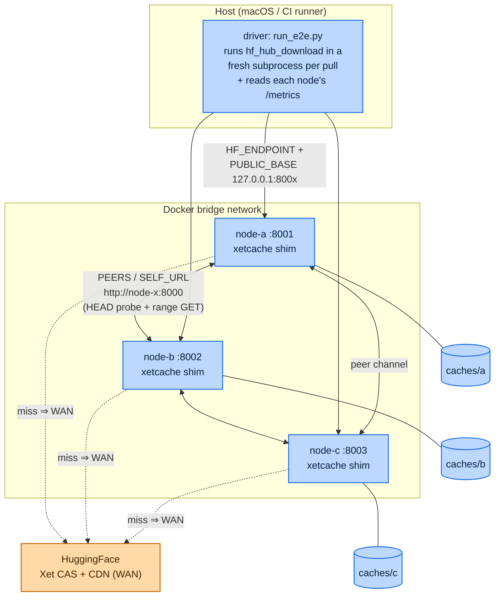

# Cross-DC peering end-to-end test

Boots real shim containers that peer with each other, and drives real
`hf_hub_download`s through them against the live HuggingFace CDN to prove the
cache behavior end-to-end: cross-node peering and cross-revision reuse
(`node-a`/`node-b`/`node-c`, scenarios `peering`/`snapshot`/`sharded`/
`concurrency`), plus byte-budget eviction on an isolated fourth node
(`node-evict`, scenario `eviction`).

## Run

From the repo root (needs Docker + network):

```bash
uv run deploy/e2e/run_e2e.py
```

Override the model (default `SmolLM2-1.7B-Instruct`, ~3 GB, downloaded a few
times):

```bash
SMOKE_REPO=org/model SMOKE_REV=main SMOKE_PATH=model.safetensors \
  uv run deploy/e2e/run_e2e.py
```

Run a subset with `E2E_SCENARIOS` (comma list; unset = all, in
`scenarios.ORDER`: `peering`, `snapshot`, `sharded`, `concurrency`,
`eviction`):

```bash
E2E_SCENARIOS=peering,eviction uv run deploy/e2e/run_e2e.py
```

The script builds the image, starts the stack, runs the selected scenarios,
prints a PASS/FAIL summary, and tears the stack down.

**Full-run download cost**: beyond the peering scenarios' SmolLM2 pulls
(~3 GB, a few times), scenario #2 (`sharded`) pulls Qwen2.5-3B-Instruct twice
(cold + warm) at ~6 GB, and scenario #4 (`eviction`) forces repeated re-pulls
of the same file past a 1 GiB cache budget (~2.8 GB of re-fetches). Budget
~10 GB+ of fresh WAN traffic for a full, unfiltered run.

## Architecture

Three shim containers peer over the Docker bridge; the driver on the host pulls
models *through* them and reads each node's `/metrics` to prove where the bytes
came from. Two URL spaces are in play at once (see "Networking model" below):
the client follows **host-facing** rewritten URLs, while the shims reach each
other by **container-facing** service name.



On a miss a shim first probes its peers over the private bridge (cheap LAN hop);
only if no peer has the xorb does it fall back to the WAN CDN. Per-node caches
are host bind-mounts (`caches/{a,b,c}`) so the driver can reset a node to "cold"
between scenarios.

A fourth service, `node-evict` (`docker-compose.yml`), is deliberately
*isolated* — no `PEERS`/`SELF_URL`, its own bind-mount (`caches/evict`), its
own host port (`8004`) — and runs with `XORB_CACHE_MAX_GIB: "1"` so scenario #4
can force real byte-budget eviction without perturbing the peered nodes'
caches or metrics.

## How the scenarios run

Each scenario reshapes cache/peer state, does one pull, and asserts on the
`/metrics` delta. State carries forward: scenario 2's peer hit works *because*
scenario 1 left `node-c` warm.

```mermaid
sequenceDiagram
    autonumber
    participant D as driver (host)
    participant A as node-a
    participant C as node-c
    participant E as node-evict
    participant W as HF CDN (WAN)

    Note over A,C: all caches reset → cold
    D->>W: ground-truth DIRECT pull (no shim) → record sha256

    Note over D,W: ── Scenario 1 — WAN fallback (node-c, peers cold) ──
    D->>C: pull model.safetensors
    C->>A: peer probe (HEAD) → miss
    C->>W: fetch xorbs
    W-->>C: bytes
    C-->>D: bytes (sha == truth)
    Note right of C: wan_bytes↑, peer_misses↑, peer_bytes 0<br/>node-c now WARM

    Note over D,C: ── Scenario 2 — peer warm hit (node-a cold, node-c warm) ──
    D->>A: pull model.safetensors
    A->>C: peer probe + range GET
    C-->>A: bytes over LAN
    A-->>D: bytes (sha == truth)
    Note right of A: peer_bytes↑, wan_bytes 0 (peer displaced WAN)

    Note over D,W: ── Scenario 3 — resilience (node-b/c stopped, node-a reset cold) ──
    D->>A: pull model.safetensors
    A-->>A: peer probe → peers unreachable
    A->>W: fall back to CDN
    W-->>A: bytes
    A-->>D: bytes (sha == truth)
    Note right of A: wan_bytes↑, peer_bytes 0<br/>node-a now WARM

    Note over D,A: ── Scenario 4 — cross-revision dedup (peers still down, node-a warm) ──
    D->>A: pull SAME file at a different, byte-identical revision
    A-->>A: reconstruct from cached xorbs (same Xet identity)
    A-->>D: bytes (sha == truth)
    Note right of A: hits↑, wan_bytes 0, peer_bytes 0

    Note over D,W: ── #1 — snapshot_download, mixed LFS + non-LFS (node-a reset cold) ──
    D->>A: snapshot_download(SmolLM2 repo)
    A->>W: fetch LFS shard(s) + plain-HTTP config/tokenizer files
    W-->>A: bytes
    A-->>D: full file manifest (sha == truth per file)
    Note right of A: wan_bytes↑; every non-LFS companion file byte-identical<br/>(the Content-Length regression would surface here as a hard failure)

    Note over D,C: ── #2 — sharded model, multi-file peering (Qwen2.5-3B, all nodes reset cold) ──
    D->>C: snapshot_download(Qwen2.5-3B, 2 shards + index)
    C->>W: cold WAN pull of both shards
    W-->>C: bytes
    Note right of C: node-c warm; wan_bytes↑, peer_bytes 0
    D->>A: snapshot_download(Qwen2.5-3B) — node-a cold, node-c now warm
    A->>C: peer probe + range GET per shard
    C-->>A: shard bytes over LAN
    Note right of A: peer_bytes↑ (multi-file peering, not just single-blob)

    Note over D,A: ── #3 — concurrent cold pulls, singleflight (node-a reset cold) ──
    D->>A: 6× concurrent pull of the SAME cold file
    A->>A: singleflight collapses the fan-out to one upstream fetch
    A->>W: fetch xorbs ONCE
    W-->>A: bytes
    A-->>D: bytes to all 6 callers (sha == truth)
    Note right of A: wan_bytes↑ once; served_bytes↑ ×6<br/>(wan_bytes ≤ served_bytes / 2 proves the collapse)

    Note over D,W: ── #4 — byte-budget eviction (node-evict, isolated, XORB_CACHE_MAX_GIB=1) ──
    D->>E: pull a file larger than the 1 GiB budget
    E->>W: fetch xorbs, evicting older ones to stay under budget
    W-->>E: bytes
    D->>E: re-pull the SAME file
    E->>W: re-fetch the now-evicted xorbs
    Note right of E: misses↑ on the re-pull (evicted xorbs re-fetched from WAN)<br/>bytes still byte-identical both times — eviction never yields a false HIT
```

## What it asserts

1. **WAN fallback** — a download through `node-c` while every peer is cold pulls
   from the CDN (`wan_bytes` up, `peer_misses` up, `peer_bytes` == 0) and the
   bytes match a direct download.
2. **Peer warm hit** — a download through cold `node-a` once `node-c` is warm is
   served from the peer (`peer_bytes` up, and `peer_bytes >= wan_bytes`), still
   byte-identical.
3. **Resilience** — with `node-b`/`node-c` stopped and `node-a` cold, the same
   download still completes via the CDN (`wan_bytes` up, `peer_bytes` == 0):
   peering is an accelerator, never a dependency.
4. **Cross-revision dedup** — with peers still down and `node-a` now warm, a pull
   of the *same file at a different, byte-identical revision* is served from
   `node-a`'s own cache (`hits` up, `wan_bytes` == 0, `peer_bytes` == 0):
   unchanged files across model versions reconstruct from the same xorbs, so
   re-pulls at a pinned-but-unchanged revision cost zero WAN.

Scenarios #1–#4 (`deploy/e2e/scenarios/`) build on the same peered stack:

1. **Snapshot (mixed LFS + non-LFS)** (`snapshot.py`) — a full
   `snapshot_download` of SmolLM2 through cold `node-a` produces a file
   manifest byte-identical to a direct download (`got == truth`) and
   `wan_bytes` > 0. This is the Content-Length regression trap: a HEAD-to-
   `resolve` for a *non-LFS* file (config.json, tokenizer.json) that drops
   `Content-Length` fails the whole snapshot, not just the LFS shard, so this
   is a hard failure if it breaks rather than a soft metric miss.
2. **Sharded model, multi-file peering** (`sharded.py`) — Qwen2.5-3B
   (2 safetensors shards + index) pulled cold through `node-c` shows
   `wan_bytes` > 0 and `peer_bytes` == 0; the same repo pulled through cold
   `node-a` once `node-c` is warm shows `peer_bytes` > 0 for *both* shards —
   peering isn't limited to single-blob transfers.
3. **Concurrent cold pulls (singleflight)** (`concurrency.py`) — 6 concurrent
   callers cold-pulling the same file through `node-a` all get identical
   bytes, and `wan_bytes` stays at most half of `served_bytes`
   (`0 < wan_bytes <= served_bytes / 2`): the fan-out collapses to (at most)
   one upstream fetch instead of 6.
4. **Byte-budget eviction** (`eviction.py`) — against the isolated
   `node-evict` (`XORB_CACHE_MAX_GIB=1`), a file larger than the budget is
   pulled, then re-pulled: the re-pull shows `misses` > 0 (evicted xorbs were
   genuinely re-fetched from WAN, not served from a stale/false HIT) while
   bytes stay identical to a direct download both times.

## Networking model

Two deliberately different URL spaces (see `docker-compose.yml`):

- **`PUBLIC_BASE`** is host-facing (`http://127.0.0.1:800x`) — the client (the
  driver on the host) follows the rewritten `cas`/`xorb` URLs, so they must
  resolve from the host.
- **`PEERS` / `SELF_URL`** are container-network-facing (`http://node-x:8000`) —
  the shims reach each other by compose service name over the bridge network.

Per-node caches are host bind-mounts under `caches/` (git-ignored) so the driver
can reset them between scenarios — the distroless image has no shell to `rm`
from inside.
