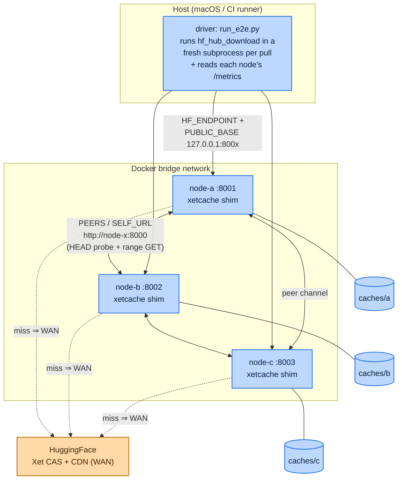
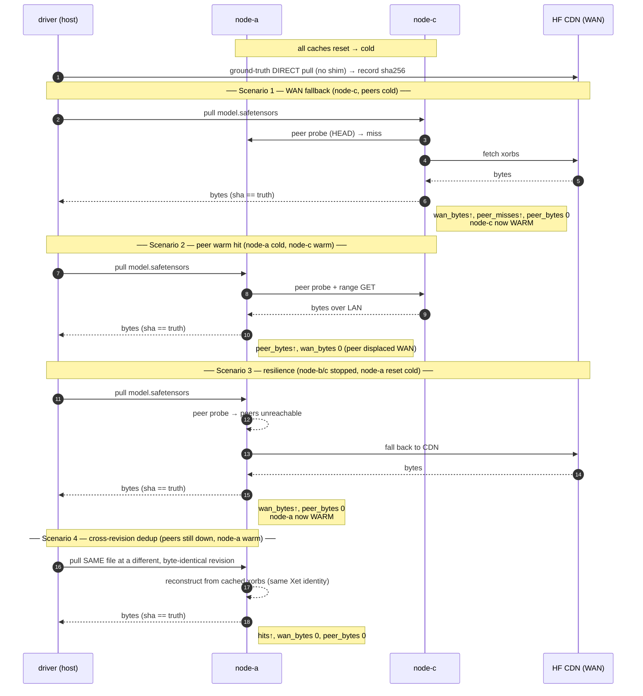

# Cross-DC peering end-to-end test

Boots three real shim containers (`node-a`, `node-b`, `node-c`) that peer with
each other, and drives real `hf_hub_download`s through them against the live
HuggingFace CDN to prove the cache behavior end-to-end — cross-node peering and
cross-revision reuse.

## Run

From the repo root (needs Docker + network):

```bash
uv run deploy/e2e/run_e2e.py
```

Override the model (default `SmolLM2-1.7B-Instruct`, ~3 GB, downloaded a few
times):

```bash
SMOKE_REPO=org/model SMOKE_REV=main SMOKE_PATH=model.safetensors \
  uv run deploy/e2e/run_e2e.py
```

The script builds the image, starts the stack, runs the scenarios, prints a
PASS/FAIL summary, and tears the stack down.

## Architecture

Three shim containers peer over the Docker bridge; the driver on the host pulls
models *through* them and reads each node's `/metrics` to prove where the bytes
came from. Two URL spaces are in play at once (see "Networking model" below):
the client follows **host-facing** rewritten URLs, while the shims reach each
other by **container-facing** service name.



On a miss a shim first probes its peers over the private bridge (cheap LAN hop);
only if no peer has the xorb does it fall back to the WAN CDN. Per-node caches
are host bind-mounts (`caches/{a,b,c}`) so the driver can reset a node to "cold"
between scenarios.

## How the scenarios run

Each scenario reshapes cache/peer state, does one pull, and asserts on the
`/metrics` delta. State carries forward: scenario 2's peer hit works *because*
scenario 1 left `node-c` warm.



## What it asserts

1. **WAN fallback** — a download through `node-c` while every peer is cold pulls
   from the CDN (`wan_bytes` up, `peer_misses` up, `peer_bytes` == 0) and the
   bytes match a direct download.
2. **Peer warm hit** — a download through cold `node-a` once `node-c` is warm is
   served from the peer (`peer_bytes` up, and `peer_bytes >= wan_bytes`), still
   byte-identical.
3. **Resilience** — with `node-b`/`node-c` stopped and `node-a` cold, the same
   download still completes via the CDN (`wan_bytes` up, `peer_bytes` == 0):
   peering is an accelerator, never a dependency.
4. **Cross-revision dedup** — with peers still down and `node-a` now warm, a pull
   of the *same file at a different, byte-identical revision* is served from
   `node-a`'s own cache (`hits` up, `wan_bytes` == 0, `peer_bytes` == 0):
   unchanged files across model versions reconstruct from the same xorbs, so
   re-pulls at a pinned-but-unchanged revision cost zero WAN.

## Networking model

Two deliberately different URL spaces (see `docker-compose.yml`):

- **`PUBLIC_BASE`** is host-facing (`http://127.0.0.1:800x`) — the client (the
  driver on the host) follows the rewritten `cas`/`xorb` URLs, so they must
  resolve from the host.
- **`PEERS` / `SELF_URL`** are container-network-facing (`http://node-x:8000`) —
  the shims reach each other by compose service name over the bridge network.

Per-node caches are host bind-mounts under `caches/` (git-ignored) so the driver
can reset them between scenarios — the distroless image has no shell to `rm`
from inside.
