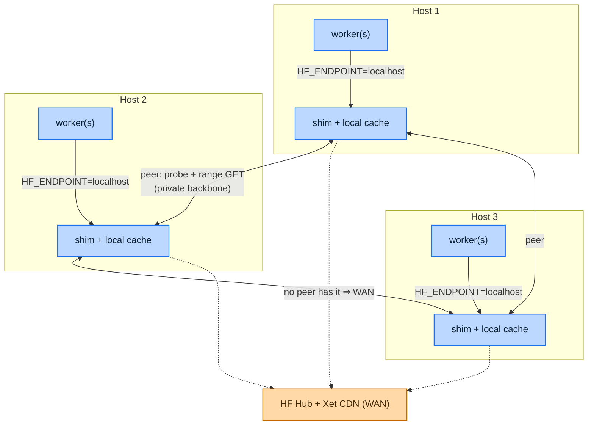

# Cache topology: host-level vs DC-level shims

Where should the shim run, and how many of them per datacenter? This is the one
architectural decision the cache engine itself does not make — the same binary
serves every topology. This doc lays out the choices, the trade-offs, and the
recommended default so a reader can reason about a rollout without re-deriving it.

> The go/no-go and the *scope* (host / rack / DC) are decided empirically by the
> locality study in `study/` — see [The decision gate](#the-decision-gate) below.
> This doc is about the shapes you can deploy once that study says "yes."

## Two decisions, not one

"Host-level or DC-level" sounds like one question but is really two, and keeping
them apart is what unlocks the good answer:

1. **Placement** — where the cache bytes physically live relative to the worker.
   Determines warm-read latency.
2. **Sharing** — how widely a cached copy is reused across workers. Determines
   storage footprint and how much WAN a whole fleet re-pays.

A naive reading couples them ("share widely ⇒ put the cache in one central
place"). They decouple cleanly, and decoupling them is the whole point of the
peering tier.

## The three shapes

### 1. Host-level, isolated

One shim per host, cache on that host's local disk. Each worker points
`HF_ENDPOINT` at `localhost`. No shim talks to any other.

- **Warm read:** local disk — the fastest possible, no network hop at all.
- **Storage:** every host independently caches every model its workers pull, so
  a model hot fleet-wide exists in *N* copies.
- **Chokepoint:** none. Load is perfectly distributed.
- **Blast radius:** one host. A shim crash affects only its own workers.
- **Trust boundary:** trivial — worker and shim share a host; nothing on the wire.

### 2. DC-level (shared cache nodes)

A small number of dedicated cache hosts serve every worker in the DC. Workers
point `HF_ENDPOINT` at a shared address (behind a VIP for HA).

- **Warm read:** a LAN hop on *every* read, hot or cold.
- **Storage:** one copy of each model serves the whole DC — best dedup.
- **Chokepoint:** the cache node's NIC. A scale-out event where hundreds of
  workers cold-start the same model at once lands the entire thundering herd on
  that one link — which is the exact cost this system exists to remove, merely
  relocated from the WAN to the backbone.
- **Blast radius:** the whole DC. A cache node down = everyone falls back to WAN
  (a degradation, not an outage — see resilience below).
- **Trust boundary:** widens. Worker→shim now crosses the network carrying the
  client's HF token in plaintext (the shim forwards client tokens upstream). Only
  acceptable on a trusted, isolated backbone — see `deploy/README.md`.

### 3. Host-level placement + DC-level sharing (recommended)

One shim per host (local-disk warm reads), and the shims **peer** with each other
over the private backbone. On a local miss a shim pulls the range from a warm
sibling before paying the WAN cost of the CDN. This is Tier 1.5 — see the peering
sections of the top-level `README.md` and
`docs/superpowers/specs/2026-09-03-peer-transfer-optimization-design.md`.

- **Warm read:** local disk (shape 1's win).
- **Storage:** still *N* copies in the worst case, but bounded by per-host
  eviction, and copies land only where models are actually used.
- **Chokepoint:** none. A cold miss draws from whichever peers are warm; load
  spreads across the mesh, and an adaptive hedge caps tail latency by racing the
  CDN only when a peer lags.
- **Blast radius:** one host, and peering is a strict *accelerator* — every peer
  failure mode falls through to the CDN, so a request can never fail that the CDN
  would have served (validated by the peers-down e2e scenario).
- **Trust boundary:** worker→shim stays on-host; only shim↔shim peer traffic
  crosses the network, and that channel can be gated with `SHIM_AUTH_TOKEN`.

This recovers most of DC-level's dedup benefit (the first host to pull a model
seeds it for the rest at LAN speed) **without** a central node to saturate or to
lose. That is why it is the default recommendation.

## Side by side

| | Warm-read latency | Storage footprint | Chokepoint | Blast radius | Trust boundary |
|---|---|---|---|---|---|
| **Host-level, isolated** | local disk (best) | *N* copies | none | one host | on-host (trivial) |
| **DC-level (shared)** | LAN hop on every read | 1 copy (best dedup) | cache-node NIC | whole DC | network (tokens on wire) |
| **Host-level + peering** | local disk | *N* copies, bounded | none | one host | on-host + gated peer channel |

## When DC-level still wins

Prefer the shared shape only when per-host storage amplification is the binding
constraint — e.g. the working set of distinct models is large, each host's disk
is small, and the locality study shows workers for a given model are *not*
clustered onto a stable set of hosts (so per-host caches thrash). Even then,
first consider a **shared cache tier layered under the peer mesh** (a networked
volume the peers can seed from) rather than a central proxy in the data path —
it keeps warm reads local while giving one durable copy to re-warm from.

## Deployment shape (vendor-neutral)

The shim is a single static Go binary. Two supervision shapes cover the top: run
it as a **per-host system service / daemon** (one instance per host, cache on
local NVMe) for shapes 1 and 3, or as a **small pool of dedicated cache hosts**
behind a VIP for shape 2. Either way:

- **`PUBLIC_BASE` must be the address workers actually reach the shim at** — it is
  baked into the URLs handed back to clients. The localhost default only works for
  same-host workers.
- Workers need exactly one change: `HF_ENDPOINT` pointed at the shim. No image or
  client changes.
- Peering is off by default; enable it with `PEERS` / `SELF_URL` (sibling base
  URLs on the backbone). `SHIM_AUTH_TOKEN` gates the peer channel only — client
  traffic relies on network isolation.

See `deploy/README.md` for the concrete single-host service install (systemd unit,
service account, config template) — that guide is topology-agnostic and is the
building block for both the daemon and the shared-pool shapes.

## Storage & eviction

Sizing is a working-set question, not a "cache all of HF" question. Because Xet
dedup is whole-file and revisions of a model share xorbs, the effective footprint
scales with the number of *distinct models* in the working set, not the number of
deployments or revisions.

Two independent limits bound the cache; whichever bites first evicts the
least-recently-used entries:

- **`XORB_CACHE_MAX_GIB`** — optional logical byte budget (`0` = no budget).
- **`CACHE_MIN_FREE_PCT`** — always-on disk-free watermark (default 10%), measured
  against real free space via `statfs`, so it adapts to any disk size and can't
  fill the volume.

Eviction never yields a false HIT: the hit decision is a per-request disk check,
and cache writes are atomic (temp file + rename), so a partial or evicted entry
is a clean MISS, not corrupt bytes. This is asserted by the byte-budget eviction
e2e scenario.

**Durability of the warm cache** is a topology-dependent trade-off:

- **Per-host daemon:** use local NVMe. Persistence across restarts matters little
  — a restarted host re-warms from its peers, not the WAN.
- **Shared cache pool:** persistent storage that survives a restart is usually
  worth it, because re-warming from the WAN is precisely the tax being removed —
  but confirm it against the alternative before paying for it.

## The decision gate

Do not choose a topology by intuition — the locality study in `study/` decides it
on real data:

- Extract a real placement-event log (schema + SQL in
  `study/placement-locality-measurement.md`).
- Run `placement_locality_sim.py` and read **`stickiness_x`** (`hit_rate` /
  `random_baseline`):
  - **> 1** — the scheduler already clusters a model's workers onto a stable host
    set; a host-local cache compounds that. Choose **host-level** (shape 1 or 3).
  - **≈ 1** — hits are just pool-size luck; host-local won't pay. Reconsider scope
    (rack/DC) or don't build a fleet-wide cache at all.
- The `hit_rate` vs `cache_gib` knee gives per-node cache sizing.

This gate, and the ordered rollout that follows it, are tracked in
`docs/deployment-readiness-handoff.md` (Step 2 = the study, Step 3 = topology).
