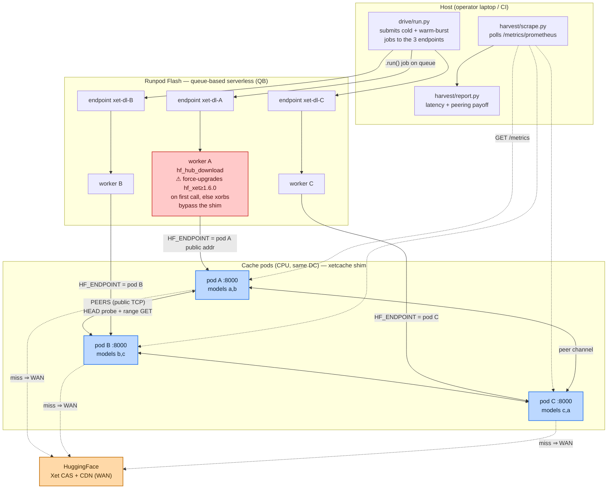
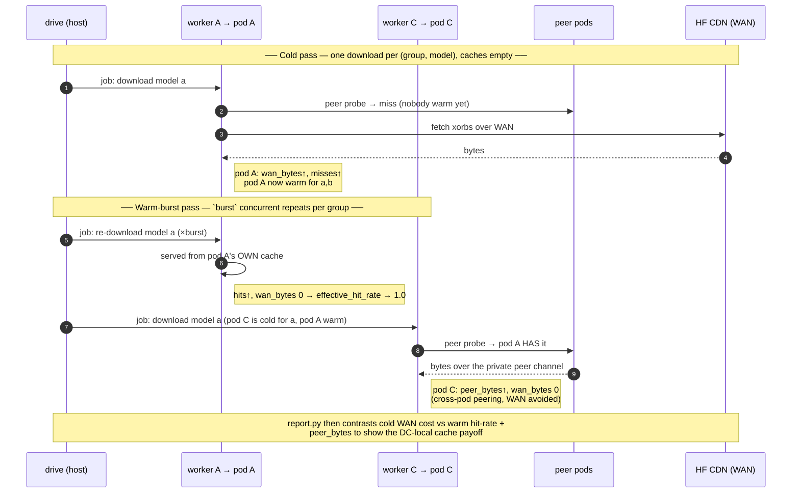

# Runpod cache testbed

Drives the Go xet-cache shim (`shim-go/`) on real Runpod infrastructure: 3
peered CPU pods running the cache, 3 Runpod Flash CPU serverless endpoints
acting as download-timing workers, and a harness that provisions, drives a
multi-model cold/warm-burst workload through the fleet, harvests
`/metrics/prometheus`, and tears everything down.

This directory uses an **underscore** package name, `runpod_testbed/`
(importable as `runpod_testbed.*`), even though some design docs refer to it
as `runpod-testbed`.

## Architecture

Unlike the local Docker e2e (`deploy/e2e/`, which runs the shim in containers
on one host), this testbed runs on **real Runpod infrastructure**: the shim on
CPU pods, and the HuggingFace clients on **Flash serverless workers** that pull
*through* those pods. The host only orchestrates — it never downloads a model
itself.



Two things make this path faithful to how real HF users pull models — and are
easy to get wrong:

- **`HF_ENDPOINT` interception, not a custom client.** Each Flash endpoint is
  deployed with `HF_ENDPOINT` set to its paired pod's public address, so a stock
  `hf_hub_download` on the worker transparently routes all traffic through the
  shim. No image or client changes.
- **The hf_xet force-upgrade.** Flash's base image ships `hf_xet 1.3.2`, which
  fetches Xet xorbs *directly from the CAS* and ignores the shim's rewritten
  URLs — silently bypassing the cache. The worker handler force-upgrades to
  `hf_xet ≥ 1.6.0` on its first invocation so xorb bytes actually flow through
  the pod. (Proper fix is upstream in Flash; see the memory note.)

## How the workload runs

`drive/run.py` expands `config.toml`'s `overlap` matrix into two passes. The
overlap is deliberately arranged so every model lives on **two** pods
(`A={a,b}`, `B={b,c}`, `C={c,a}`) — that is what creates cross-pod peer hits in
the warm pass.



The `report.py` output makes the payoff concrete. A representative live run:
pod A `effective_hit_rate 1.0` (served ~9.4 GB entirely from its own warm
cache), pod C `peer_bytes ~4.64 GB` (pulled a peer's bytes instead of the WAN),
with total WAN eliminated in the tens of GB across the fleet.

## Prerequisites

- `RUNPOD_API_KEY` with permission to create pods and deploy Flash endpoints.
- A throwaway/scoped `HF_TOKEN` — see the plaintext-token warning below.
- A container registry you can push to (for the cache-pod image only).
- `uv tool install runpod-flash` (puts the `flash` CLI on `PATH`). The
  `runpod` Python client used by the scripts is pulled per-invocation via
  `uv run --with runpod ...` below — no global install.
- Go toolchain for `make build-linux` (repo root `Makefile`).

## COST WARNING

Every successful `up.py` run creates **3 live Runpod pods** and deploys
**3 Flash serverless endpoints**. All of these bill for as long as they
exist. `down.py` is mandatory after every run — do not leave a run
provisioned. `up.py` tears itself down automatically if provisioning fails
partway through, but a run that "succeeds" still requires an explicit
`down.py` afterward. If a run is interrupted (Ctrl-C, crashed shell, killed
`uv run`), check `data/state-<runid>.json` and run `down.py` against it
manually — a written state file is the source of truth for what needs
tearing down, not the process that created it.

## PLAINTEXT-TOKEN EXPOSURE WARNING

The cache pods forward the client's HF token upstream in cleartext over
public TCP (see the shim's trust-boundary note in the repo root
`CLAUDE.md` / `deploy/README.md`). In this testbed the pods are exposed on
a public Runpod TCP forward so the Flash workers (which run in a separate
network) can reach them. That means:

- **Use a throwaway or narrowly-scoped `HF_TOKEN`.** Never point this
  testbed at a token with write access or access to private/sensitive repos.
- The shim itself is a trusted-LAN component; this testbed deliberately
  exposes it publicly for staging convenience. Do not reuse this
  configuration as a template for anything production-facing without
  revisiting that trust boundary.

## EU-RO-1 pin

Runpod Flash CPU serverless is available in **EU-RO-1 only** as of this
writing. `config.toml`'s `dc` field pins the cache pods to the same
datacenter so pod<->worker latency stays LAN-local. If Flash CPU becomes
available elsewhere, moving `dc` without also revisiting the worker
instance type will silently force GPU workers (cost + capacity
implications) — treat a region change as a deliberate config + Task-3
worker change, not a one-line edit.

## Flash artifact limit

Flash's packaged-function upload has a **500 MB** artifact limit. The
worker handler (`worker/flash_app.py` + `worker/timing.py`) only needs
`huggingface_hub`/`hf_xet` plus stdlib, so it is comfortably under this —
do not add heavy deps (torch, transformers, etc.) to `worker_deps` in
`config.toml` or the 500 MB limit will bite.

## Run recipe

All commands run from the **repo root** (`xet-dc-cache/`) unless noted —
`drive/run.py` and `up.py` read/write paths relative to cwd
(`runpod_testbed/worker/.flash/flash_manifest.json`, `data/*.json`).

### 1. Build the cache-shim Linux binary

```bash
make build-linux
```

Produces `xetcache-linux-amd64` **at the repo root** (the Makefile does
`cd shim-go && go build -o ../xetcache-linux-amd64 .`) — not under
`shim-go/`. `runpod_testbed/provision/cache.Dockerfile` copies it from the
repo root; keep both in sync if the Makefile output path ever changes.

### 2. Build and push the cache-pod image

```bash
make -C runpod_testbed image IMAGE=<registry>/xet-cache-testbed:latest
docker push <registry>/xet-cache-testbed:latest
```

`make image` runs `build-linux` (step 1) then `docker build` for
`linux/amd64` from the repo root — so step 1 is optional when you use it.
Set `IMAGE` to match your `config.toml` `cache_image`. The **worker side
needs no image at all** — Flash packages `worker/flash_app.py` and its
declared deps directly from source at `flash deploy` time.

### 3. Install and authenticate the Flash CLI

`make -C runpod_testbed setup` does the mechanical parts of steps 3–4 for
you (installs the `flash` CLI if missing, scaffolds `config.toml`), then
prints the manual steps below. Or do it by hand:

```bash
uv tool install runpod-flash   # installs the `flash` CLI onto PATH
flash login                    # authenticates the flash CLI with Runpod
```

`flash login` handles the **flash CLI's** Runpod credential for you (it's
what `up.py` shells out to for `flash deploy`). It does **not** cover the
`runpod-python` SDK path — `up.py`/`down.py`/`scrape.py` construct a
`Fleet()` that reads `RUNPOD_API_KEY` from the environment (step 5), and
that key is also injected into each pod so its self-config can resolve peer
addresses. So `flash login` + `RUNPOD_API_KEY` in the env cover the two
halves; you don't configure the key for the CLI twice.

### 4. Configure the run

```bash
cp runpod_testbed/config.example.toml runpod_testbed/config.toml
$EDITOR runpod_testbed/config.toml   # fill in registry, cache_image, models, overlap
```

`config.toml` is gitignored — it can carry account-specific registry paths.

### 5. Export secrets

```bash
export RUNPOD_API_KEY=...    # for the runpod-python SDK (Fleet) + injected into pods
export HF_TOKEN=...          # throwaway/scoped — see warning above
export SHIM_AUTH_TOKEN=...   # arbitrary bearer secret for the peer channel
```

(`flash login` in step 3 already handled the flash CLI's copy of the key —
`RUNPOD_API_KEY` here is for the SDK-driven provisioning/teardown/scrape.)

### 6. Provision the fleet

```bash
make -C runpod_testbed up
```

Creates 3 EU-RO-1 CPU pods (one per overlap group), waits for each to
report a public address and a green `/healthz`, then runs
`flash deploy --env xet-<runid>` from `runpod_testbed/worker/` to stand up
3 Flash CPU endpoints wired to the pods' addresses. On success it prints
`UP runid=... pods=[...] flash_env=... addrs={...}` and writes
`data/state-<runid>.json`. **Note the `<runid>` — it is generated
internally (a timestamp), not something you choose.** On any failure it
tears itself down and re-raises.

### 7. Validate wiring with a dry run

```bash
make -C runpod_testbed dry-run CACHE_URL=http://<pod-addr>:8000
```

Downloads `config.toml`'s `models` directly against one cache pod's public
address (bypassing Flash entirely) to confirm the shim is reachable and
serving before spending Flash invocations. (The target passes the `dryrun`
placeholder for `run.py`'s otherwise-required `runid` positional, which is
unused on the `--dry-run` path.)

### 8. Start the metrics harvester (background)

```bash
make -C runpod_testbed scrape RUNID=<runid> &
```

Polls each pod's `/metrics/prometheus` on the interval from
`config.toml`'s `scrape_interval_s` (overridable by an optional second CLI
arg) and appends to `data/pod-metrics-<runid>.parquet`. Leave it running for
the duration of step 9; kill it (or let it keep running harmlessly)
afterward.

### 9. Drive the workload

```bash
make -C runpod_testbed drive RUNID=<runid>
```

Expands `config.toml`'s `overlap` matrix into cold (one download per
group/model) then warm-burst (`burst` concurrent repeats) jobs, submits
them to the 3 Flash endpoints (resolved from
`runpod_testbed/worker/.flash/flash_manifest.json` — see known unknowns
below), and appends per-job timing rows to `data/jobs-<runid>.jsonl`.

### 10. Generate the report

```bash
make -C runpod_testbed report RUNID=<runid>
```

Reads `data/jobs-<runid>.jsonl` + `data/pod-metrics-<runid>.parquet` and
produces latency-by-phase and peering-payoff summaries.

### 11. Tear down

```bash
make -C runpod_testbed down RUNID=<runid>
```

`flash undeploy`s the endpoints and terminates all pods, tolerating errors
on either side (so a partially-torn-down state can be safely re-run against
the same state file). **This step is mandatory — do not skip it.**

## Known unknowns to confirm on the first live run

These are documented, unit-tested assumptions that could not be verified
without a live Runpod/Flash account. Each has a named fallback if wrong.

1. **`flash_manifest.json` shape.** `drive/run.py`'s `endpoint_ids()`
   assumes `runpod_testbed/worker/.flash/flash_manifest.json` has the shape
   `{"endpoints": [{"function": "xet-dl-A", "endpoint_id": "..."}]}`. A
   best-effort read of Flash's public docs/source suggests the real
   manifest may instead carry a `functions[]` array (name/module/
   resource_name/routes) plus a `resources[]` array, with function-name ->
   endpoint_id resolution happening at call time via a separate State
   Manager GraphQL lookup rather than a static list baked into the
   manifest file. **On the first live `flash deploy`, inspect
   `runpod_testbed/worker/.flash/flash_manifest.json` directly** and, if it
   doesn't match the assumed shape, adjust `endpoint_ids()` in
   `drive/run.py` (and its unit test in `tests/test_drive.py`) before
   trusting any endpoint calls made from it.
2. **`Fleet.list_pods_by_prefix` GraphQL shape.** `provision/fleet.py`
   queries `myself { pods { ... } }` to discover sibling pods by name
   prefix. Confirm the field names/nesting against a real GraphQL response
   on the first run; the unit tests exercise the parsing logic against a
   hand-constructed fixture, not a live schema.
3. **EU-RO-1 CPU-pod capacity for `create_pod`.** Confirm `data_center_id`
   pinning to EU-RO-1 (the resolved kwarg name/value from Task 1) actually
   succeeds under real account capacity/quota — a capacity shortfall in
   that single DC would block `up.py` with no fallback region.
4. **`flash deploy` cwd.** `up.py` runs `flash deploy --env <flash_env>`
   with `cwd="runpod_testbed/worker"`, i.e. repo-root-relative. Confirm the
   Flash CLI's packaging step picks up `worker/flash_app.py` and
   `worker/timing.py` correctly from that cwd, and that
   `uv tool install runpod-flash` put a `flash` binary on `PATH` for the
   environment `up.py` inherits (it passes through `os.environ` plus the
   deploy env). If `flash` isn't found, run `uv tool update-shell` or add
   `~/.local/bin` to `PATH`.

## Validated run

**PENDING** — the live `up -> dry-run -> down` end-to-end validation
against a real Runpod account has intentionally **not** been run as part
of this task (it requires a funded account and spends real money; deferred
to the human operator). Before relying on this testbed for real
measurements, an operator should run the recipe above once with
`max_pods=3`, `burst=2`, and small/fast models, and confirm:

- [ ] All 3 EU-RO-1 pods reach a green `/healthz` within `up.py`'s timeout.
- [ ] `flash deploy` provisions exactly 3 CPU endpoints without error.
- [ ] The known unknowns above (manifest shape, GraphQL pod-list shape,
      EU-RO-1 capacity, `flash deploy` cwd/packaging) all resolve as
      assumed — or the code has been adjusted to match reality.
- [ ] `drive/run.py --dry-run <cache_url> dryrun` downloads succeed through
      a pod before spending any Flash invocations.
- [ ] `down.py` removes every pod and every Flash endpoint, and running it
      a second time against the same (now-empty) state file is a safe
      no-op (no errors from double-teardown).

Once confirmed, replace this section with the actual runid, timings, and
any corrections made to the known-unknowns above.

## Appendix: raw commands (what the Makefile targets run)

The steps above use `make -C runpod_testbed <target>` (see
`runpod_testbed/Makefile`, or `make -C runpod_testbed help`). Every recipe
`cd`s to the repo root first and declares its deps with `uv run --with …`.
If you'd rather run them directly, these are the equivalents (all from the
repo root):

```bash
# test
uv run --with pytest pytest runpod_testbed/tests -v
# image        (build-linux first: it drops xetcache-linux-amd64 at repo root)
make build-linux && docker build --platform linux/amd64 \
  -f runpod_testbed/provision/cache.Dockerfile -t <registry>/xet-cache-testbed:latest .
# up   (run as a module so the repo root is on sys.path — a bare
#       `uv run path/to/up.py` puts the script's dir on the path instead
#       and `import runpod_testbed` fails)
uv run --with runpod python -m runpod_testbed.provision.up runpod_testbed/config.toml
# dry-run
uv run --with huggingface_hub --with hf_xet \
  python -m runpod_testbed.drive.run --dry-run http://<pod-addr>:8000 dryrun
# scrape
uv run --with runpod --with pyarrow \
  python -m runpod_testbed.harvest.scrape data/state-<runid>.json
# drive
uv run --with runpod python -m runpod_testbed.drive.run runpod_testbed/config.toml <runid>
# report
uv run --with pyarrow --with matplotlib python -m runpod_testbed.harvest.report <runid>
# down
uv run --with runpod python -m runpod_testbed.provision.down data/state-<runid>.json
```
